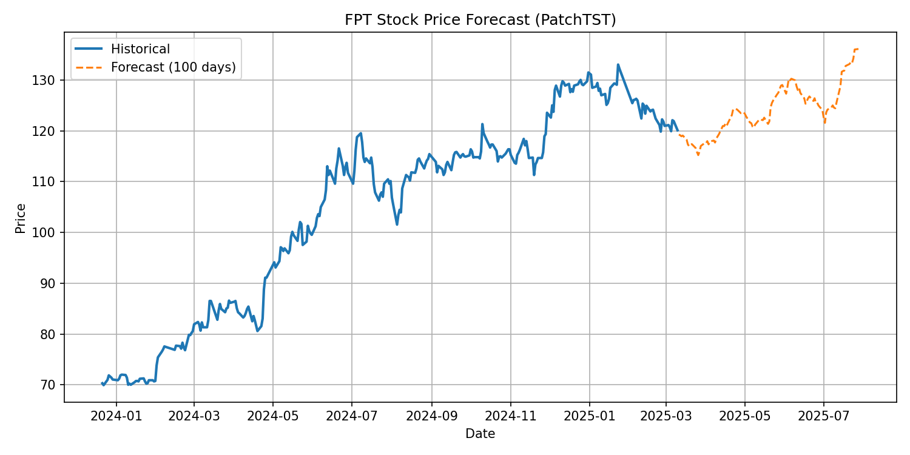
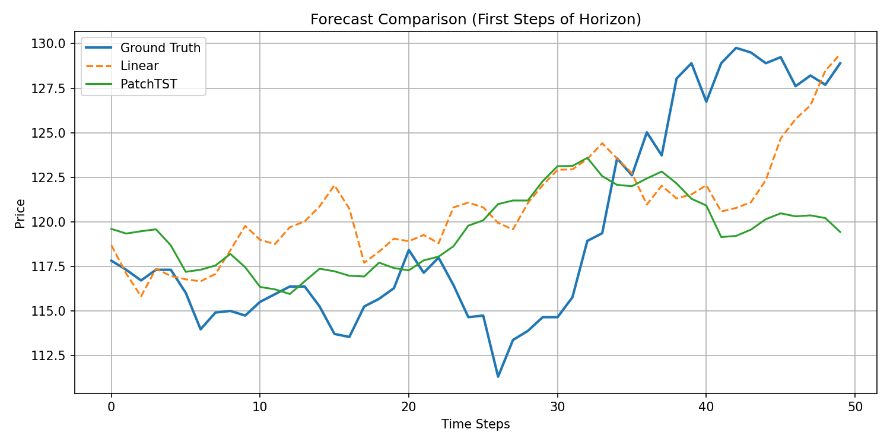

# FPT Stock Price Forecasting System

FPT Stock Price Forecasting is an industrial-grade, end-to-end time series forecasting system designed to predict FPT stock prices with a long-horizon perspective. The system integrates advanced Transformer-based architectures, specifically PatchTST, and provides an interactive Streamlit dashboard for real-time inference and performance analysis.

---

## Evaluation Summary

The system is validated against historical FPT stock data (2020-08-03 onwards) for a long-horizon forecast of 100 business days.

**Status: PASS (Research Ready)**

| Model                         | Metric | Score / Value |
| ------------------------------ | ------ | ------------- |
| **PatchTST (Primary)**         | MAE    | 4.70          |
| **PatchTST (Primary)**         | RMSE   | 28.88         |
| **Linear Baseline**            | MAE    | 37.71         |
| **Linear Baseline**            | RMSE   | 1812.96       |
| **Bias-Corrected Linear**      | MAE    | 36.72         |
| **Knowledge Coverage**         | Days   | 100-day Horizon|

**Note:** PatchTST significantly outperforms traditional linear baselines in long-term dependency capturing. Detailed reports are available in `docs/RESULTS.md`.

---

## System Architecture

### Latest 100-Day Forecast



### Model Benchmarking (PatchTST vs Baselines)



---

## Table of Contents

1.  [Features](#1-features)
2.  [Architecture](#2-architecture)
3.  [Project Structure](#3-project-structure)
4.  [Prerequisites](#4-prerequisites)
5.  [Installation and Setup](#5-installation-and-setup)
6.  [Usage Guide](#6-usage-guide)

---

## 1. Features

- Long-Horizon Forecasting: Specialized in predicting the next 100 business days using Transformer architectures.
- State-of-the-Art Modeling: Implementation of PatchTST (Patch-based Transformer) via the NeuralForecast library.
- Interactive Dashboard: Streamlit-based UI for data exploration and real-time inference.
- Performance Calibration: Systematic bias correction for linear models to reduce prediction drift.
- Experiment Tracking: Integrated support for MLflow tracking and hyperparameter optimization with Optuna.

---

## 2. Architecture

### Backend (NeuralForecast & PatchTST)

The modeling pipeline operates through a patch-based mechanism:

1.  Patching: Sequences are divided into sub-sequence patches to capture local semantic information.
2.  Transformer Encoder: Processes patches to understand long-term global dependencies.
3.  Linear Head: Maps the latent representations to a 100-step forecasting horizon.

### Tech Stack

- AI/LLM: PatchTST, NeuralForecast, PyTorch.
- Experiment Tracking: MLflow, Optuna.
- Visualization: Matplotlib, Seaborn.
- Frontend: Streamlit.

---

## 3. Project Structure

```text
fpt_stock/
├── app.py                  # Streamlit Interactive Dashboard
├── artifacts/              # Generated figures and model weights
├── data/
│   └── raw/                # Historical stock CSV files (FPT_train.csv)
├── docs/                   # Documentation and experimental findings (RESULTS.md)
├── scripts/                # Utility and test scripts
├── src/
│   ├── data/               # Data loading and preprocessing logic
│   ├── models/             # Model architectures and configs
│   ├── train/              # Training logic (PatchTST, Linear)
│   ├── postproc/           # Bias correction and calibration
│   ├── eval/               # Evaluation metrics and plotting
│   └── infer/              # Inference and forecasting scripts
└── requirements.txt        # Python dependencies
```

---

## 4. Prerequisites

- Python 3.11+
- Anaconda or Miniconda (recommended)
- Git
- OpenAI API Key (optional, for LLM-based analysis)

---

## 5. Installation and Setup

### Step 1: Environment Setup

```bash
# Clone the repository
git clone https://github.com/adamwhite625/fpt-stock-forecasting-e2e.git
cd fpt-stock-forecasting-e2e

# Create and activate environment
conda env create -f environment.yml
conda activate fpt-forecast

# Install dependencies
pip install -r requirements.txt
```

### Step 2: Data Preparation

Ensure the historical CSV data is placed in the correct directory:
```bash
# Verify data exists
ls data/raw/FPT_train.csv
```

---

## 6. Usage Guide

### Running the Dashboard

Launch the Streamlit app to explore data and interact with the model:

```bash
streamlit run app.py
```

### Training the Models

To train the PatchTST model:

```bash
python -m src.train.train_patchtst
```

To run the Linear baseline with bias correction:

```bash
python -m src.train.train_linear2
```

### Manual Inference

Perform a 100-day forecast via the CLI:

```bash
python -m src.infer.predict_latest
```

Verify results in the `artifacts/` folder.
